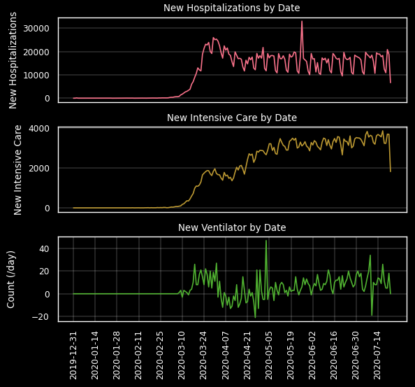
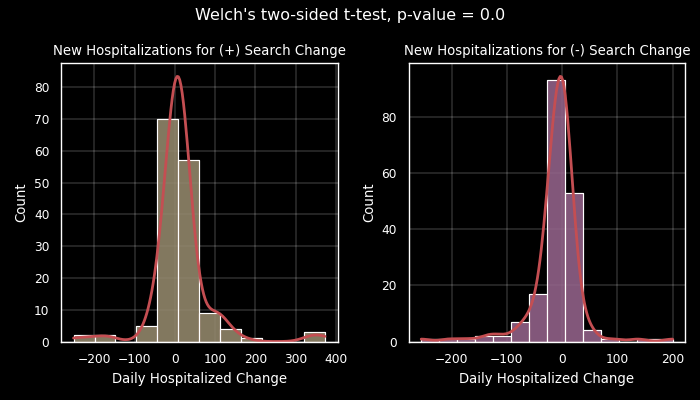
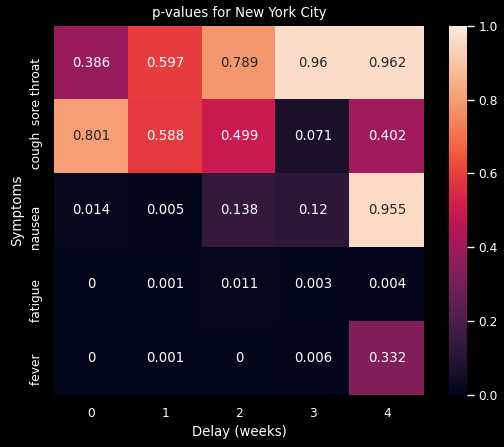

  # COVID-19 Google Searches for Symptoms
  
  

    Are Google searches for COVID-19 symptoms useful in predicting increases in COVID-19 patients?
    Exploratory data analysis and hypothesis testing using Google's COVID-19 Open Data database
     
    <a href="https://github.com/chrisshaffer/covid-symptom-searches"><strong>Explore the docs »</strong></a>
     
  

<!-- TABLE OF CONTENTS -->

  
<h2 style="display: inline-block">Table of Contents</h2>

  <ol>
    <li>
      <a href="#about-the-project">About The Project</a>
      <ul>
        <li><a href="#built-with">Built With</a></li>
      </ul>
      <ul>
        <li><a href="#repository-structure">Repository Structure</a></li>
      </ul>
    </li>
    <li>
      <a href="#data">Data</a>
    </li>
    <li>
      <a href="#features">Features</a>
    </li>
    <li>
      <a href="#contact">Contact</a>
    </li>
  </ol>

<!-- ABOUT THE PROJECT -->
## About The Project

COVID-19 has been a rapidly evolving pandemic. It is important for hospitals and governments to be able to predict the spread of COVID-19 and future pandemics locally, in order to prepare and allocate resources. This project provides tools to explore data from [Google's COVID-19 Open Data.](https://github.com/GoogleCloudPlatform/covid-19-open-data) 

### Built With
<b>Python 3.9</b>:

Data modules
* pandas
* numpy

Plotting modules
* matplotlib
* seaborn
* scipy.stats

Misc. modules
* math
* warnings
* datetime
* itertools

Custom functions found [here]

### Repository structure
* img: Figure image files
* src: Custom Python functions and Jupyter Notebooks
A PowerPoint presentation summarizing the data analysis and hypothesis testing results can be found [here](/COVID-19 Symptom Searches and Hospitalizations.pptx)

## Data
This project explores 3 tables from the COVID-19 Open Data repo:
* [Search Trends symptoms dataset](https://github.com/GoogleCloudPlatform/covid-19-open-data/blob/main/docs/table-search-trends.md)
  * Dimensions: (1 425 194, ~450)
* [Hospitalization records](https://github.com/GoogleCloudPlatform/covid-19-open-data/blob/main/docs/table-hospitalizations.md)
  * Dimensions: (643 715, 11)
* [Index: keys, codes, and names for countries and regions](https://github.com/GoogleCloudPlatform/covid-19-open-data/blob/main/docs/table-index.md)
The search trends and hospital tables are joined using location keys and dates.

## Features
* Load data with control over query size
* Generate plots for EDA to explore variables
Example of hospitalization data versus time:

* Hypothesis testing of correlation between Google symptom searches and new hospitalizations
  * By location (country/region)
  * By symptom names
  * By date range
  * By time shift between searches and new hospitalizations
Example of single test (Time shift: 2 weeks, symptom: fever, location: New York City

Example of p-value heatmap:

<!-- Contact -->
## Contact

Author: Christopher Shaffer
[Email](christophermshaffer@gmail.com)

[Github](https://github.com/chrisshaffer)
